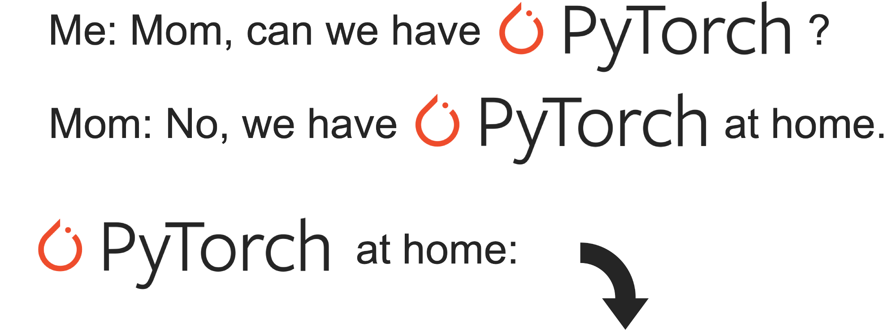

######
Flint
######

A toy deep learning framework implemented in Numpy from scratch with a `PyTorch <https://github.com/pytorch/pytorch>`_-like API. I'm trying to make it as clean as possible.

Flint is not as powerful as torch, but it is still able to start a fire.

************
Installation
************

.. code-block:: bash

    git clone https://github.com/Renovamen/flint.git
    cd flint
    python setup.py install

or

.. code-block:: bash

    pip install git+https://github.com/Renovamen/flint.git --upgrade

.. toctree::
   :maxdepth: 1
   :caption: API Documentation

   api/flint
   api/tensor
   api/nn
   api/nn.functional
   api/nn.init
   api/optim
   api/utils.data

.. toctree::
   :maxdepth: 1
   :caption: Tutorials

   tutorials/simple

*********************
Features
*********************

Core
=====================

Support autograding on the following operations:

- Add
- Substract
- Negative
- Muliply
- Divide
- Matmul
- Power
- Natural Logarithm
- Exponential
- Sum
- Max
- Softmax
- Log Softmax
- View
- Transpose
- Permute
- Squeeze
- Unsqueeze
- Padding

Layers
=====================

- Linear
- Convolution (1D / 2D)
- MaxPooling (1D / 2D)
- Flatten
- Dropout
- Sequential

Optimizers
=====================

- SGD
- Momentum
- Adagrad
- RMSprop
- Adadelta
- Adam

Loss Functions
=====================

- Cross Entropy
- Negative Log Likelihood
- Mean Squared Error
- Binary Cross Entropy

Activation Functions
=====================

- ReLU
- Sigmoid
- Tanh

Initializers
=====================

- Fill with zeros / ones / other given constants
- Uniform / Normal
- Xavier (Glorot) uniform / normal (`Understanding the Difficulty of Training Deep Feedforward Neural Networks. <http://proceedings.mlr.press/v9/glorot10a/glorot10a.pdf>`_ *Xavier Glorot and Yoshua Bengio.* AISTATS 2010.)
- Kaiming (He) uniform / normal (`Delving Deep into Rectifiers: Surpassing Human-level Performance on ImageNet Classification. <https://arxiv.org/pdf/1502.01852.pdf>`_ *Kaiming He, et al.* ICCV 2015.)
- LeCun uniform / normal (`Efficient Backprop. <http://yann.lecun.com/exdb/publis/pdf/lecun-98b.pdf>`_ *Yann LeCun, et al.* 1998.)

Others
=====================

- Dataloaders

*********************
License
*********************

`MIT <https://github.com/Renovamen/flint/blob/main/LICENSE>`_

*********************
Acknowledgements
*********************

Flint is inspired by the following projects:

- `PyTorch <https://github.com/pytorch/pytorch>`_
- `karpathy/micrograd <https://github.com/karpathy/micrograd>`_
- `teddykoker/tinyloader <https://github.com/teddykoker/tinyloader>`_
